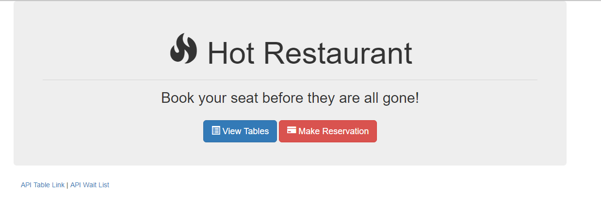

# HotRestaurant

## Table of Contents

* [Project Goal]
* [Project Description]
* [Installation of dependencies]
* [Challenges]
* [How to use the Application ?]
* [License]
* [Contributing Authors]
* [Author]
* [Tests]

## Project Goal

In this project, we will create an  application made up of two parts:

1. A front-end set of HTML/CSS/JS pages for entering and viewing data and
2. A back-end composed of Node/Express and basic JS for storing, updating, and relaying reservation data.

## Project Description

The purpose of this application is to map out the steps and logics behind building a strong application. And make use of the concepts we've covered in class so far:

- Servers
- Routing
- APIs
- AJAX (GET and POST Requests)

## Installation of dependencies
 1. npm install express

## Challenges (Dividing the tasks into phases)

### Phase I - Write out the pieces that will need to be programmed to create the functionality of your application.

- Create the front-end (visuals) for home page, reservation form, and reservation views.

- Create a basic server using Express.JS

- Create a few array variables that will hold the data

- Create a set of routes for getting and posting table data

- Create a set of routes for displaying the HTML pages

- Use `fetch` or `jQuery` to run AJAX calls to GET and POST data from users to the Express server

---

### Phase II - Aim to complete the following tasks
- Backend Team:

Create a basic Express server.

Your server at this point should do the BARE MINIMUM. (Effectively, it should just say: "Listening at PORT 3000" when the command node server.js is run.)

- Frontend Team:

Create three HTML files one called home.html, another called tables.html, and another called reserve.html. Use dummy data and create pages similar to the one shown to you on the sample Hot Reservation webpage.
All: If you finish early, begin thinking about how the Data, API, and Routes should look.

---

### Phase III - Aim to complete the following tasks

- Backend Team:

Create a set of variables (hint: arrays of objects) for holding the reservation and waitlist data

Create a set of routes that then return this data as JSON. Users should be given these JSON results if they visit the appropriate page (i.e. if a user visits localhost:3000/api/tables they should see a JSON array of table data).

- Frontend Team:

Temporarily join the backend team. Your task will be to create Express routes that display your HTML pages when a user visits the appropriate page. (i.e. if a user visits localhost:3000/tables... they should be shown the table.html page.)

If you finish early begin creating the code necessary to convert your form data into JSON objects.

---

### Phase IV - Aim to complete the following tasks

- Backend Team:

Create the logic that handles reservation requests. Your code should work such that POST requests take in JSON objects, checks if there is any space left, then adds the JSON object to either the reservation array or the waitlist array. Your POST route should also respond to requests with a confirmation (true or false) of whether or not the requestor has a reservation (or is on the waiting list).

You should be using Postman to do all your testing at this point.

- Frontend Team:

Begin to do serious research on AJAX. Specifically, focus your attention on how AJAX can be used to do both GET and POST requests.

Then create the necessary code on your tables.html page such that it can retrieve data from the Backend Team's API. In essence you will be creating an AJAX GET request to retrieve the data.

Then create the necessary code on your reserve.html page such that it can send data to the Backend Team's API. In essence you will be creating an AJAX POST request to send the data.

All: This is the most challenging part of today's activity. Be persistent! You can do this!

---

### Phase V - Aim to complete the following

All:
Complete any remaining functionality from the previous phase if you need more time.

Then, thoroughly test your application for bugs. Check if there are any obvious ways to crash the application.

Then, if you have more time -- begin to tackle any bonus of your choice:

- Add buttons for "checking off" individuals from the reservation list. Once this happens, the next person on the waitlist should be addd to the main reservation list.

- Add code to your server so that it "counts" every time a person visits any of the pages. Display a running count on the website.

- Add a button for sending emails to individuals on the wait-list letting them know they have a table ready. You will need to use node-mailer or a similar npm package to make this work. (A hard task, but very cool).

- Add a button for sending text messages to individuals on the wait-list letting them know they have a table ready. You will need to use the Twilio library to make this work. (A hard task, but very cool).

---

* Description: Basic app demonstrating Node and Express with jQuery. Overall purpose is to help schedule reservation requests. Restaurant has just 5 tables available. First five requests get a reservation, every request after that is sent to the waiting list.
* Live Demo: <https://hot-restaurant-fsf.herokuapp.com/>

## How to use the application ?
In the terminal windows : RUN "node server.js"

## License 
Apache License Version 2.0 (See file ./licence.txt)

## Contributing Authors
Classroom Activity

## Author
Classroom Activity

## Tests
See the related screenshot images in ./images/ folder
